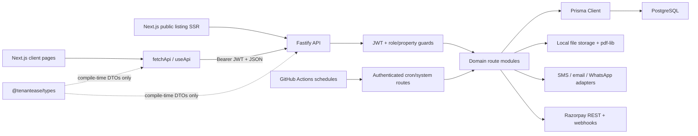

# TenantEase Full-Project Audit

**Audit date:** 2026-07-11; remediation and UI redesign verified 2026-07-16  
**Audit target:** Current working tree, including existing uncommitted files  
**Scope:** Frontend, backend, API integration, auth/RBAC, database, money flows, files, providers, webhooks, jobs, security, accessibility, tests, dependencies, documentation, and operations

## Executive verdict

TenantEase is a real, compiling full-stack monorepo. It is not a disconnected UI prototype. Core owner, tenant, staff, payment, reporting, file, reminder, and public-listing paths are wired from Next.js to Fastify to Prisma/PostgreSQL.

All four original release blockers and all ten high-severity code findings were remediated. Current recommendation is **GO for staging**, then **conditional GO for production** after real Razorpay/provider staging, managed object storage/malware scanning, external monitoring, and backup/restore validation.

**Release recommendation: STAGING-GO.** Do not enable real money until Razorpay test-mode E2E and webhook replay tests pass against configured dashboard credentials.

Original blockers now closed:

1. Razorpay Checkout now opens from tenant payment UI; webhook remains final authority.
2. Webhook events are reclaimable, provider IDs are unique, and financial mutations use transactions/idempotency keys.
3. Utility billing has explicit per-model allocation with exact rounding tests.
4. Access JWT expires in 15 minutes; rotating refresh token uses HttpOnly cookie; access token stays in memory.
5. `/pg/*` is public and protected blob downloads use authenticated fetches.
6. Offline payment reports now create owner-addressed claims with approve/reject workflow.
7. Staff property context, route access, and role-filtered navigation are integrated.
8. Production dependency bulk audit reports no known vulnerabilities across 238 installed packages.
9. Frontend now uses a responsive, accessible “Night Ledger Editorial” design system across owner, tenant, staff, admin, auth, and public surfaces.

## Remediation result

| Finding group | Status | Implemented fix |
|---|---|---|
| B-01 to B-04 | **Resolved** | Checkout, webhook recovery, correct utility allocation, immutable/capped payments |
| H-01 to H-05 | **Resolved** | JWT expiry, HttpOnly refresh cookie, strict production config, public route matcher, authenticated downloads |
| H-06 to H-10 | **Resolved** | Payment claims, staff UI/property access, plan enforcement, loopback/password DB compose, dependency overrides |
| M-01 to M-03 | **Resolved** | Reminder dedupe/frequency, advisory room locks + authoritative counts, clear historical-room 422 |
| M-04 | **Substantially resolved** | Payment, utility, maintenance, room transfer/create, claim approval, and receipt creation boundaries hardened; durable external outbox remains future scale work |
| M-05 | **Code resolved / ops pending** | Magic-byte validation, attachment headers, storage deletion; production AV/quarantine and object storage require deployment services |
| M-06 to M-12 | **Resolved** | Order expiry/balance checks, invoice ID lifecycle, downgrade policy, notice workflow, strict inputs, safe CSV import/export |
| M-13 | **Partially resolved** | Error-code drift fixed and more shared DTOs used; generated OpenAPI client remains maintainability work |
| M-14 to M-16 | **Resolved in app** | CSP/security headers/logging/readiness/timeouts, accessible dialogs/forms/nav, keyboard + responsive browser audit |
| M-17 | **Partially resolved** | CI, clean migration replay, scheduled jobs added; hosting, managed backups, restore drill, and APM need production account configuration |
| M-18 to M-19 | **Resolved** | Isolated `_test` DB enforcement; README/runbook/audit corrected |
| UI/UX | **Resolved** | New responsive visual system, shared components, accessible dialogs/forms/navigation, desktop/mobile browser checks |
| Cleanup | **Resolved** | Fallow dead-code 0 issues, unused dependencies removed, trailing whitespace removed, Redis removed |

Historical finding sections below preserve original evidence and recommended solutions. Remediation table, current posture sections, and final verification are authoritative for current tree.

## What exists

| Area | Current implementation |
|---|---|
| Monorepo | pnpm workspaces: API, web, shared types |
| Frontend | Next.js 16 App Router, React 19, Tailwind 4, 27 routes |
| Backend | Fastify 5 modular monolith, 109 registered HTTP routes |
| Data | Prisma 7, PostgreSQL, 33 models, 23 enums, 15 migration folders |
| Contracts | Shared TypeScript DTO/error types in `packages/types` |
| Auth | Phone OTP, JWT access token, opaque rotating refresh token, ADMIN/OWNER/STAFF/TENANT |
| Storage/PDF | Local filesystem, `pdf-lib` receipts/settlements/agreements |
| External adapters | SMS, email, WhatsApp, Razorpay; mock and HTTP modes |
| Tests | 6 API test files with 47 tests; Playwright smoke plus Python visual/journey audits |
| Code size | 134 TypeScript/TSX files; Fallow analyzed 22,944 lines |

## Actual architecture and integration

Request path is usually:

1. Client page calls `fetchApi` or `useApi`.
2. `api-client.ts` adds Bearer access token.
3. Fastify route validates selected inputs with Zod.
4. Auth plugin verifies JWT plus current user row.
5. Property/tenant/resource guard enforces ownership or staff permission.
6. Prisma reads/writes PostgreSQL.
7. Serializer returns `{ success: true, data }`.

This path is integrated and verified. Public listing SSR and Razorpay Checkout deliberately use their server/external boundaries; protected app calls use the shared authenticated client. Remaining scale work is generated runtime contracts and durable outbox/object-storage infrastructure.

## Original integration snapshot (pre-remediation)

This matrix records what the audit initially found. Current outcomes are in **Remediation result** and **Verification results**.

| Feature | Backend | Frontend | End-to-end status | Main gap |
|---|---:|---:|---|---|
| Owner OTP/register/onboarding | Yes | Yes | Mostly integrated | JWT/session security |
| Tenant OTP/login | Yes | Yes | Integrated for active booking | New unknown phone becomes tenant without booking |
| Admin auth/user controls | Yes | Yes | Integrated | Settings page mostly static; pagination parsing weak |
| Properties/settings | Yes | Yes | Integrated | Staff cannot use property context |
| Rooms | Yes | Yes | Mostly integrated | Concurrent occupancy and historical-room deletion |
| Tenants/import/transfer/vacate | Yes | Yes | Mostly integrated | No notice-period workflow; non-atomic side effects |
| Rent generation/status | Yes | Yes | Integrated | Month input validation and scheduler missing |
| Manual payments/receipts | Yes | Yes | Partly safe | Overpayment allowed; online records mutable; PDF writes non-atomic |
| Tenant offline payment report | Yes | Yes | **Not integrated to owner** | Notification is visible only to tenant feed |
| Tenant online payment | Order/webhook exists | Partial | **Incomplete** | No Razorpay checkout invocation |
| Receipt/agreement downloads | Protected APIs exist | Buttons exist | **Broken** | `window.open` sends no Bearer token |
| Maintenance | Yes | Yes | Mostly integrated | Several related writes not transactional |
| Announcements | Yes | Yes | Integrated | Missing audit logging on owner mutations |
| Utilities | Yes | Yes | **Financially incorrect** | Billing model ignored; full room charge duplicated per tenant |
| Reminders | Yes | Yes | Partial | Duplicate sends; weekly frequency ignored; plan flags ignored |
| Agreements | Yes | Yes | Partial | Download broken; weak date/text/PDF validation |
| Public listings/enquiries | Yes | Yes | **Public page broken** | Global auth redirects `/pg/*` to login |
| Reports/export | Yes | Yes | Mostly integrated | Weak query validation; CSV formula injection risk |
| Staff/RBAC | Strong backend base | Profile-only portal | **Frontend incomplete** | Owner pages reject staff and `/properties` is owner-only |
| Subscriptions | Yes | Yes | Partial | Webhook retry/invoice lifecycle/downgrade usage gaps |
| Cron/system jobs | HTTP routes exist | N/A | External integration absent | No scheduler, queue, retry worker, or job locks |
| Redis | Container only | N/A | **Not integrated** | Zero runtime Redis usage |
| CI/CD/deployment | No | No | **Absent** | No workflows, Dockerfiles, or platform config |
| Monitoring/backups/analytics | No | No | **Absent** | Docs-only plans |

## Findings and brief solutions

### Blockers

#### B-01 — Tenant online rent checkout is incomplete

**Evidence:** `apps/web/app/tenant/page.tsx:335-340` creates an order. `apps/web/app/tenant/page.tsx:461` only displays provider order ID. No Razorpay script/SDK/checkout invocation exists in web source.

**Impact:** Tenant cannot complete online payment from TenantEase, despite UI and docs presenting online payment as available.

**Fix:** Load Razorpay Checkout safely, pass `keyId`, `providerOrderId`, amount, currency, tenant details, and handle success/failure. Keep server webhook as final payment authority. Add a real Razorpay test-mode E2E.

#### B-02 — Webhook partial failures become non-retryable

**Evidence:** Payment and subscription routes return `duplicate_event` immediately at `online-payments/routes.ts:164` and `subscriptions/routes.ts:267`. Payment processing then performs payment create, order update, rent recalculation, receipt generation, and event completion separately at `online-payments/routes.ts:261-285`.

**Impact:** Crash/failure after payment creation but before receipt/event completion leaves partial state. Razorpay retry uses same event ID, is treated as duplicate, and cannot repair it. Different event IDs for one payment can also race because `Payment.referenceNumber` is not unique.

**Fix:** Use state-aware idempotency: processed events return success; `RECEIVED`/`FAILED` events are claimable for retry. Put DB mutations in one serializable transaction. Add unique provider payment ID. Generate file via durable job/outbox, or make receipt generation retry-safe after commit.

#### B-03 — Utility billing can multiply charges

**Evidence:** `billingModel` is stored at `utilities/routes.ts:162/170`, but logic always computes a room charge and applies the whole value to every active room tenant at `utilities/routes.ts:180-201`.

**Impact:** A two-bed room can receive the full utility charge twice. `FLAT_RATE`, `PER_TENANT`, `INDIVIDUAL_METER`, and `SHARED_METER` behave effectively the same.

**Fix:** Define formula per model. For room-shared usage, allocate once or split deterministically with rounding. For individual meters, require tenant/meter identity. Compute all changes first, then commit readings and rent updates in one transaction. Add multi-tenant financial tests.

#### B-04 — Manual payment API permits invalid financial states

**Evidence:** `payments/routes.ts:13-44` validates positive amount but never caps it to remaining balance. API schema permits `ONLINE`; update/delete paths can edit or void gateway-created online payments without refund/reconciliation.

**Impact:** Overpayment creates `amountPaid > amountDue`; reports can show negative balances. Staff/owners can create fake `ONLINE` records or void captured gateway payments without Razorpay refund state.

**Fix:** Enforce remaining balance in transaction. Reject manual `ONLINE`. Make gateway payments immutable; implement explicit refund/reversal records and webhook reconciliation. Add database/provider reference uniqueness.

### High severity

#### H-01 — Access tokens never expire

**Evidence:** JWT registration at `plugins/auth.ts:32-34` sets only secret. Signing at `auth/routes.ts:20` sets no `expiresIn`.

**Impact:** Stolen access token stays valid until user deletion/block/role change. This contradicts `docs/DOC8.md`, which requires 15-minute access tokens.

**Fix:** Set JWT `sign.expiresIn: "15m"`; include token version/session ID if forced logout is needed. Test expiry and refresh behavior.

#### H-02 — Refresh token is exposed to browser JavaScript

**Evidence:** Both tokens are read/written in `localStorage` at `apps/web/lib/api-client.ts:22-48`.

**Impact:** Any XSS steals the 30-day refresh token. CSP is also absent.

**Fix:** Store refresh token in `Secure`, `HttpOnly`, `SameSite=Lax/Strict` cookie. Keep short-lived access token in memory where practical. Add CSP and rotate/revoke sessions server-side.

#### H-03 — Runtime mode fails open to development

**Evidence:** `NODE_ENV` defaults to development at `lib/env.ts:22`. Development exposes debug OTP, uses fixed cron secret, allows mock providers, and uses a known mock webhook secret.

**Impact:** Misconfigured deployment can expose OTPs and accept known development credentials.

**Fix:** Require explicit `NODE_ENV`; in production validate all required secrets/providers at startup. Reject placeholder/mock settings. Add `CRON_SECRET` to `.env.example` and runbook.

#### H-04 — Public listing UI is auth-gated

**Evidence:** `AuthContext.tsx:37` defines only `/login` and `/register` as public. All other tokenless paths redirect at `AuthContext.tsx:75`, including `/pg/[slug]`.

**Impact:** Published vacancy listing is not publicly usable.

**Fix:** Treat `/pg/*` as public via route matcher, or separate public/private layouts. Add a successful-listing E2E, not only missing-slug test.

#### H-05 — Protected PDF download buttons fail

**Evidence:** Owner agreements, tenant agreements, and tenant receipts use `window.open` at `agreements/page.tsx:84`, `tenant/agreements/page.tsx:21`, and `tenant/receipts/page.tsx:38`. Protected API requires Bearer JWT.

**Impact:** Browser navigation omits Authorization header; API returns 401.

**Fix:** Use `fetchApiBlob`, create object URL, then open/download it. Alternative: short-lived signed download URL.

#### H-06 — Tenant offline-payment report never reaches owner

**Evidence:** `tenant-portal/routes.ts:147-156` creates notification with `tenantId`. Only tenant portal queries notifications by `tenantId`; owner has no notification feed or payment-confirmation queue.

**Impact:** UI says owner was notified, but owner cannot see/approve the report.

**Fix:** Add `PaymentClaim`/`OfflinePaymentReport` model with `PENDING/APPROVED/REJECTED`, owner property queue/API/UI, notification addressed to owner user(s), and audit trail.

#### H-07 — Staff backend is integrated; staff frontend is not

**Evidence:** Backend has fine-grained permissions. Web owner pages call `useRequireRole("OWNER")`; property context calls owner-only `GET /properties`. Staff portal only lists assignments/profile.

**Impact:** STAFF can authenticate but cannot perform most operations their API permissions allow.

**Fix:** Add staff property endpoint/context, route guards accepting OWNER/STAFF, and permission-aware navigation/actions. Test MANAGER/ACCOUNTANT/WARDEN journeys.

#### H-08 — Plan feature flags are not enforced for reminders

**Evidence:** Reminder channels come directly from property config at `reminders/service.ts:30-36`; subscription `smsEnabled`, `whatsappEnabled`, and `emailEnabled` are not checked.

**Impact:** FREE can use paid SMS/WhatsApp capabilities if config enables them. Downgrade does not reconcile active configuration.

**Fix:** Intersect reminder config with active subscription entitlements server-side. Reject forbidden configuration updates. On downgrade, disable/restrict excess features and define excess property/staff behavior.

#### H-09 — Local Docker services are exposed insecurely

**Evidence:** `docker-compose.yml:10-12` sets PostgreSQL trust auth and publishes `55432` on all host interfaces. Redis publishes unauthenticated `56379` similarly.

**Impact:** Other reachable machines/processes may access local data/cache without credentials.

**Fix:** Bind `127.0.0.1:55432:5432` and `127.0.0.1:56379:6379`; remove trust auth; use local password. Never reuse this compose file as production infrastructure.

#### H-10 — Dependency security gate fails

**Evidence:** `pnpm audit --prod` reports Hono `<4.12.25`: one high CORS advisory and four moderate advisories through Prisma tooling.

**Impact:** Release violates documented no-high-vulnerability gate. Some paths may be tooling-only, but need explicit resolution/acceptance.

**Fix:** Update Prisma/transitive Hono or add safe override after compatibility tests. Re-run audit and document whether package is runtime reachable.

### Medium severity

#### M-01 — Reminder jobs are not idempotent; weekly frequency is unused

Each eligible invocation creates notifications/logs again. `overdueFrequency` is stored but never consulted. Add unique send key such as `(rentEntryId, mode, channel, scheduleDate)`, weekly date logic, job locks, and retry policy.

#### M-02 — Tenant/room occupancy is race-prone

Tenant create checks `occupiedBeds`, inserts tenant, then recalculates outside one lock/transaction. Concurrent creates/transfers/imports can overfill room. Lock room row or use serializable transaction plus authoritative active-tenant count and capacity constraint strategy.

#### M-03 — Historical rooms cannot be cleanly deleted

Delete checks denormalized `occupiedBeds`, but vacated tenants and transfer/vacate records retain restrictive room foreign keys. A visually vacant historical room can fail with unhandled DB error. Prefer room archival/soft-delete; map constraint conflicts to clear 422.

#### M-04 — Multi-step writes often commit partial outcomes

Examples: payment → rent recalculation → receipt file/row; vacate → PDF → room recalc; maintenance update → comment → status history; utility loop across rooms. Define transaction boundaries and durable outbox/jobs for external/file effects.

#### M-05 — File security and lifecycle are incomplete

Upload trusts client MIME header, performs no magic-byte or malware scan, and local deletion removes only DB row (`documents/routes.ts:123`) without deleting file. Add content sniffing, AV scan/quarantine, safe download headers (`nosniff`, attachment for risky types), storage delete API, retention cleanup, and object storage for deployment.

#### M-06 — Online order reuse ignores expiry/current balance

Existing `CREATED` order is returned without checking `expiresAt` or changed pending amount. Expire/cancel stale orders and create a fresh provider order from current balance under transaction/lock.

#### M-07 — Subscription invoice lifecycle is incomplete

Webhook marks all pending invoices paid; recurring charge events do not create a new invoice after first checkout. Match provider invoice ID, upsert one internal invoice per provider invoice, and keep immutable billing history.

#### M-08 — Immediate downgrade allows over-limit retained usage

Cancellation can set FREE while owner still has multiple properties/staff. Only new creation is blocked. Define downgrade policy: prevent immediate downgrade, schedule it, or lock excess resources read-only and require selection.

#### M-09 — Notice-period/system sync workflow is effectively dead

No production route/UI sets `NOTICE` with future `vacatedAt`; system sync only has useful work when tests manually create that state. Add notice endpoint/UI and scheduled transition, or remove misleading system route/claim.

#### M-10 — Reports/rent generation input validation is inconsistent

Reports use raw `parseInt`; rent generation accepts arbitrary billing month. Invalid month/year can produce undefined labels, invalid dates, or 500 errors. Use shared Zod query schema with month 1-12, bounded year, and strict `YYYY-MM` validation.

#### M-11 — CSV import validation leaks internals

Import bypasses main tenant schema, lacks phone/email/Aadhaar validation and duplicate-active-phone check, accepts any uploaded type, and returns `dbErr.message` to client. Reuse canonical schema, validate CSV MIME/extension/encoding, sanitize errors, and transact import consistently.

#### M-12 — CSV export permits spreadsheet formula injection

Quoting alone does not stop cells beginning `=`, `+`, `-`, or `@`. Prefix dangerous user-controlled cells with apostrophe or generate XLSX with safe cell typing.

#### M-13 — API/client contract is compile-time only and drifts

Shared package has DTO types but no runtime/OpenAPI contract. Pages use local interfaces and `any`; `fetchApi` trusts JSON casts. Standard 404 handler can emit runtime code `REQUEST_ERROR`, absent from shared error union. Generate OpenAPI/typed client or share Zod schemas; remove `any` from agreements/admin/report flows.

#### M-14 — Security headers and CSP are absent

Neither Fastify nor Next config sets CSP, HSTS, frame denial, referrer policy, permissions policy, or `nosniff`. Add headers at app/edge, start with report-only CSP, then enforce.

#### M-15 — Logging/observability is absent

Fastify starts with `logger: false`; no structured production errors, metrics, traces, Sentry/APM, alerts, or webhook/job dashboard. Enable redacted structured logs with request IDs, error monitoring, metrics, and security/finance alerts.

#### M-16 — Accessibility basics are incomplete

All custom modals lack `role="dialog"`, `aria-modal`, labelled title, focus trap/restore, and Escape handling. Many form labels lack `htmlFor`; two icon-only close buttons lack accessible names. Navigation lacks labels/current-page state. Add shared accessible Dialog/Form components and run axe + keyboard tests. Positive: visible focus and reduced-motion CSS exist.

#### M-17 — No CI/CD, deploy definition, backup, or recovery implementation

No `.github` workflows, Dockerfiles, or hosting config exist. Redis, monitoring, backup, and DR are docs-only. Add CI with clean PostgreSQL service, migrations, typecheck, tests, build, audit, E2E, coverage; add environment-specific deployment and restore-tested backups.

#### M-18 — Test environment is not isolated

Vitest reads shared root `.env`; DB tests depend on local database. This risks mutating developer data and makes CI absent/non-repeatable. Require `DATABASE_URL_TEST`, refuse non-test DB names, migrate ephemeral DB, and clean per test transaction/schema.

#### M-19 — Docs materially overstate health

README says audit and Fallow are clean and P0 is code-complete. Current audit finds vulnerabilities and Fallow finds 7 issues. Docs also describe superseded Next API architecture and controls not implemented. Mark planning docs as target-state, generate current architecture/API docs, and update readiness percentage only from passing gates.

### Low severity / cleanup

- Fallow: 5 unused exports; 2 unused dependencies (`@radix-ui/react-slot`, `date-fns`).
- `git diff --check`: 7 trailing-whitespace findings in tenant announcements page.
- Many large files remain: admin page 628 lines, tenant page 567, utilities page 488, subscriptions/tenant-portal routes near 390. Split by domain/view only where it improves testing and ownership.
- Duplicate/legacy migration names (`init` appears multiple times) increase migration comprehension cost. Add migration notes and validate clean replay in CI.
- `.env.example` omits `CRON_SECRET` although production requires it.
- `docs/` and `.agents/` are ignored; project standards/documentation may not be shared in fresh clones.
- Redis consumes local resources but provides no application value yet. Remove until needed or integrate queue/cache deliberately.

## Security posture by OWASP area

| Area | Status | Notes |
|---|---|---|
| Access control | Strong | Live-user, role, resource, property, and staff-permission guards; role-filtered UI |
| Cryptography/session | Strong | 15-minute JWT, opaque rotating refresh token in HttpOnly cookie, access token in memory |
| Injection | Strong app controls | Prisma/Zod, safe CSV export/import, validated report inputs; generated runtime contract still pending |
| Insecure design | Improved | Financial idempotency, transactions, locks, limits, webhook recovery; durable outbox remains scale work |
| Misconfiguration | Strong code controls | Strict production startup checks, CSP/headers, redaction, loopback/password local compose |
| Components | Passing | npm bulk audit: 238 production packages, 0 advisories |
| Authentication | Strong | Cryptographic OTP/token generation, throttling, expiry, rotation, origin checks |
| Integrity | Strong core flows | Provider IDs/idempotency keys unique; finance and occupancy critical sections hardened |
| Logging/monitoring | Partial | Structured redacted request/error logs and readiness exist; external APM/alerts still operational work |
| SSRF | Limited exposure | Provider URLs come from environment, not end-user input; still prefer HTTPS/host allowlists in production |

## Database/data integrity assessment

Strengths:

- UUID primary keys and explicit relations.
- Money stored as integer paisa.
- Useful uniqueness: user phone, tenant/month rent entry, property room number, webhook provider/event ID.
- Owner isolation commonly enforced before data access.
- Receipt/payment voiding retains history instead of hard-deleting finance rows.

Risks:

- `Tenant.propertyId` and `Tenant.roomId` can theoretically point across properties; DB cannot enforce compound ownership relation.
- `MaintenanceRequest.propertyId`/tenant and `Agreement.propertyId`/tenant have similar duplicated relation risk.
- Denormalized `Room.occupiedBeds` remains cached state, though critical mutation paths now lock and recalculate it authoritatively.
- Notification allows several target shapes; offline payment reports now use a separate owner-addressed claim workflow.
- Expired OTP challenges and refresh tokens have no cleanup/retention job.
- Local file rows and filesystem are not transactionally coupled.

Suggested data fixes:

1. Add cross-property compound constraints where practical; otherwise keep creation in validated services.
2. Add cleanup jobs/retention policy for OTP, tokens, webhooks, logs, and files.
3. Move files to managed object storage with AV/quarantine and durable post-commit jobs.
4. Add upgrade tests from a production-like latest-release snapshot; clean replay already passes.

## Frontend assessment

Strengths:

- Consistent shared API client, layouts, property context, formatting helpers, and DTO imports.
- Responsive desktop/mobile navigation exists.
- Loading and empty states exist on many core pages.
- Theme includes visible focus and reduced-motion support.
- Production Next build succeeds.

Weaknesses:

- Private page shell gating remains client-side; APIs are server-authorized, but middleware could reduce unauthenticated UI flashes.
- Only four Playwright smoke tests; broader Python journeys are useful but not a replacement for committed role-specific browser tests.
- Automated axe/component coverage is still absent.
- Several large page components remain high-complexity maintainability targets.
- Public SSR reads `NEXT_PUBLIC_API_URL` directly by design; central server-side endpoint validation would reduce drift.

## Backend assessment

Strengths:

- Modular route organization and clear DTO serializers.
- Consistent success/error envelope for most application errors.
- Live user lookup on every authenticated request catches blocked/deleted/role-changed accounts.
- Good owner/staff resource guards and permission matrix.
- Webhook HMAC verification and initial replay ledger exist.
- File paths have traversal protections.
- CORS origin allowlist, multipart limit, and global rate limiting exist.

Weaknesses:

- Route modules often contain business logic directly; service/transaction rules are uneven.
- No API version prefix or OpenAPI spec.
- Global rate limiting exists, but auth/public enquiry/webhook policies are not independently tuned.
- Provider calls have timeouts; retry/circuit-breaking strategy remains basic.
- Local filesystem provider is not deployable across replicas/ephemeral hosts.
- Several mutation routes omit audit logging.

## Verification results

| Check | Result | Detail |
|---|---|---|
| `corepack pnpm -r typecheck` | PASS | API, web, shared types pass |
| `corepack pnpm -r build` | PASS | API TypeScript build and Next production build pass; 27 Next routes generated including not-found |
| Prisma validate/replay/status | PASS | Clean `tenantease_test` replay applied all 15 migrations; schema is current |
| API tests | PASS | 6 files, 47/47 tests |
| Docker/DB | PASS | Compose config validates; password PostgreSQL reached on loopback for migration/tests; unused Redis removed; fixed cross-project container-name collision |
| Web Playwright E2E | PASS | 4/4 Chromium tests, including owner registration → onboarding → first property and public 404 |
| Responsive visual/journey audit | PASS | Public/auth and authenticated owner dashboard checked at 375px and 1440px; no horizontal overflow |
| `corepack pnpm audit:prod` | PASS | npm bulk endpoint audited 238 production packages: 0 advisories, 0 high/critical |
| Fallow dead-code | PASS | 0 unused files, exports, types, dependencies, cycles, or unresolved imports |
| Fallow maintainability scan | INFO | MI 90.7 (good); 7.3% duplication and 114 complexity-threshold findings remain refactoring debt, not release blockers |
| `git diff --check` | PASS | No whitespace errors; only Windows line-ending notices |
| Runtime secret shape | PASS | `.env` ignored; three auth secrets present, 64 chars, non-placeholder; values not exposed in audit |
| `.env.example` completeness | PASS | Test DB, cron, auth, provider, and Razorpay settings documented |
| Scheduled jobs | PASS in code | Authenticated GitHub Actions schedules call rent, reminders, and notice-sync endpoints; deployment secrets still required |

## Testing gaps

Remaining gaps are mostly staging, infrastructure, or depth:

- Real Razorpay test-mode checkout/capture, signed webhook delivery, refund/reversal, and dashboard reconciliation.
- Real SMS/email/WhatsApp staging delivery, failure, retry, and provider-rate-limit behavior.
- Crash injection at each webhook/outbox boundary and duplicate provider events with different event IDs.
- Full MANAGER/ACCOUNTANT/WARDEN and tenant browser journeys, including authenticated PDF/blob downloads.
- Automated axe coverage; keyboard behavior was manually/browser checked.
- Malware scanner/quarantine and managed object-storage lifecycle tests.
- Upgrade migration from a production-like snapshot, backup restore drill, load tests, coverage thresholds, APM/alert validation.

## Production activation checklist

No known code blocker remains for staging. Before production:

1. Deploy managed PostgreSQL; run `prisma migrate deploy`; enable encrypted backups; complete restore drill.
2. Set unique production JWT/OTP/cron secrets, HTTPS URLs, provider credentials, and GitHub Actions secrets.
3. Run Razorpay test-mode capture/webhook/replay/refund scenarios; only then switch live keys.
4. Validate real notification providers and budget/rate limits.
5. Replace local files with managed object storage plus malware scanning/quarantine and retention rules.
6. Add APM, metrics, finance/webhook/job alerts, log retention, and incident runbooks.
7. Run role-specific browser/axe, load, backup/restore, and production-like migration tests.
8. Generate OpenAPI/typed runtime client and split highest-risk page/route hotspots as maintainability follow-up.

## Final assessment

TenantEase is integrated from redesigned Next.js frontend through Fastify and Prisma to PostgreSQL. Core owner, staff, tenant, finance, reminder, file, subscription, public listing, and scheduled-job paths are implemented; original money/session/integration blockers are closed and verified.

Verdict: **staging-ready, conditional production-ready**. Remaining work requires production accounts/infrastructure or deeper non-blocking coverage. Do not enable live money, production OTP, or sensitive document intake until activation checklist is complete.

## Audit limitations

- No real Razorpay/SMS/email/WhatsApp credentials or provider staging endpoints were available.
- No production hosting, managed object storage/AV, APM, backup system, or restore environment existed to inspect.
- No formal penetration test, automated axe suite, or load test was run.
- Existing uncommitted worktree was treated as source of truth; audit does not distinguish intended changes from stable baseline.
