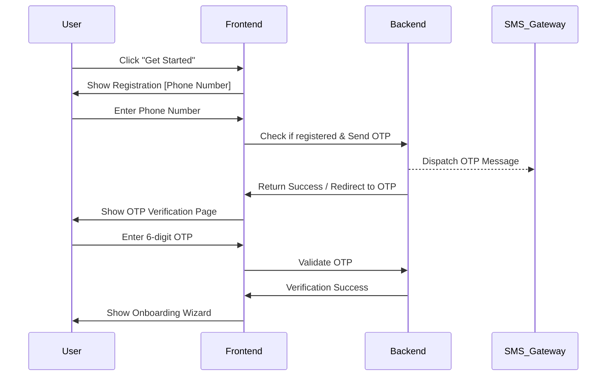
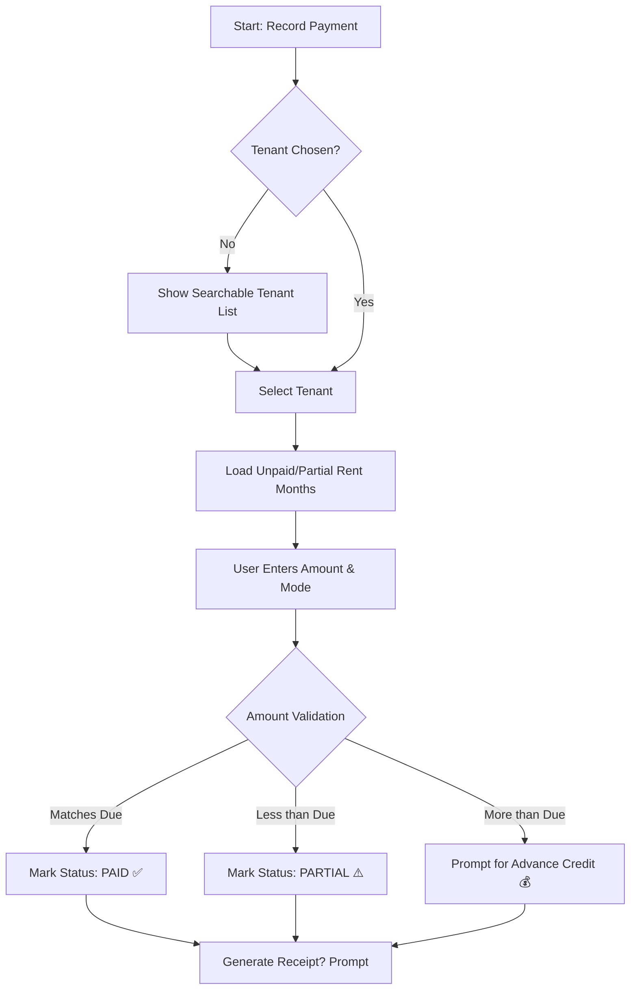
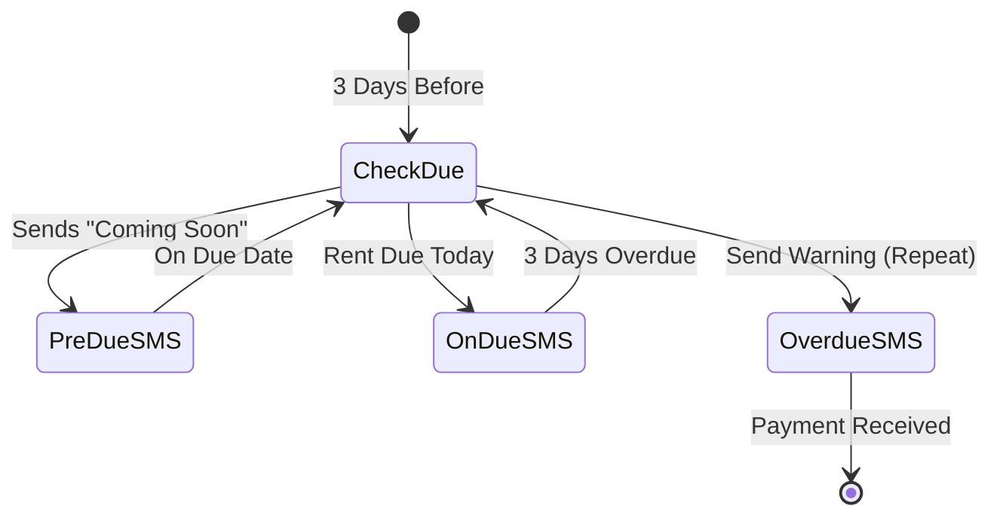
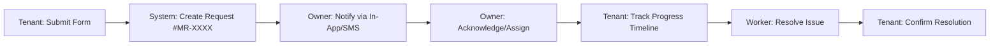
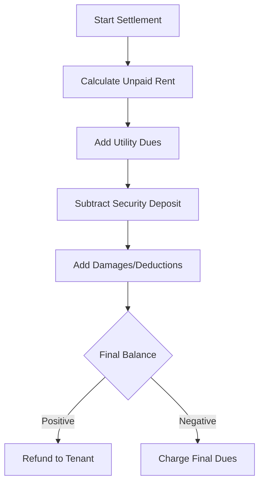
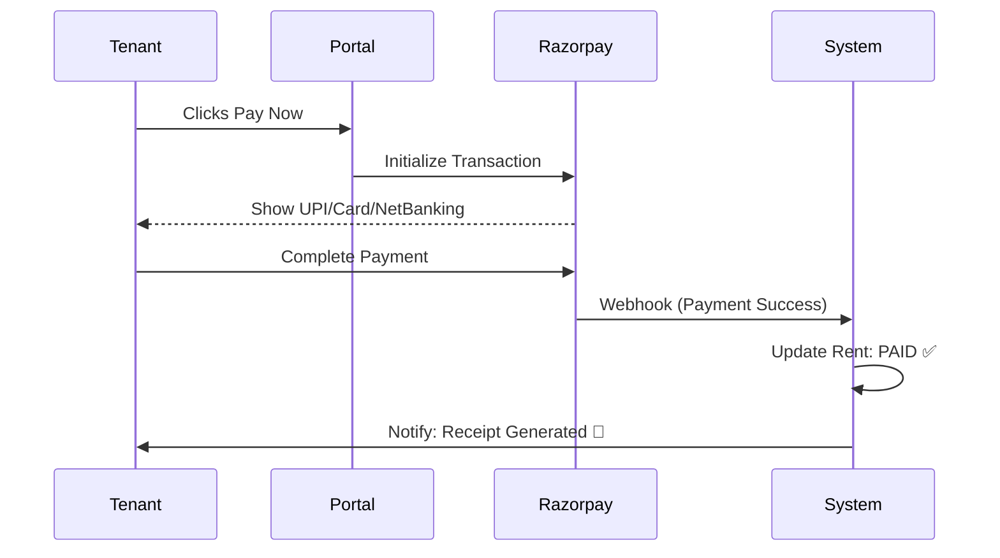

# 📄 DOCUMENT 3: USER FLOWS & JOURNEYS

| Field            | Value                                         |
| :--------------- | :-------------------------------------------- |
| **Product Name** | TenantEase                                    |
| **Version**      | 1.0 (Professional)                            |
| **Parent Docs**  | [DOC1 — Product Vision](DOC1.MD), [DOC2 — PRD](DOC2.MD) |
| **Last Updated** | March 2026                                    |
| **Status**       | **Finalized for Implementation**              |

---

## 📑 Table of Contents

1. [Document Purpose](#1-document-purpose)
2. [User Personas Reference](#2-user-personas-reference)
3. [Flow 01 — Owner Registration & Onboarding](#3-flow-01--owner-registration--onboarding)
4. [Flow 02 — Owner Login](#4-flow-02--owner-login)
5. [Flow 03 — Add Property](#5-flow-03--add-property)
6. [Flow 04 — Add Rooms](#6-flow-04--add-rooms)
7. [Flow 05 — Add Tenant](#7-flow-05--add-tenant)
8. [Flow 06 — Record Rent Payment](#8-flow-06--record-rent-payment)
9. [Flow 07 — Automated Rent Reminder Flow](#9-flow-07--automated-rent-reminder-flow)
10. [Flow 08 — Generate Rent Receipt](#10-flow-08--generate-rent-receipt)
11. [Flow 09 — Tenant Portal Login & Usage](#11-flow-09--tenant-portal-login--usage)
12. [Flow 10 — Raise Maintenance Request (Tenant)](#12-flow-10--raise-maintenance-request-tenant)
13. [Flow 11 — Manage Maintenance Request (Owner)](#13-flow-11--manage-maintenance-request-owner)
14. [Flow 12 — Vacate Tenant](#14-flow-12--vacate-tenant)
15. [Flow 13 — Room Transfer](#15-flow-13--room-transfer)
16. [Flow 14 — Utility Billing (Electricity)](#16-flow-14--utility-billing-electricity)
17. [Flow 15 — Generate Rental Agreement](#17-flow-15--generate-rental-agreement)
18. [Flow 16 — Online Rent Payment (Tenant)](#18-flow-16--online-rent-payment-tenant)
19. [Flow 17 — Bulk Tenant Import](#19-flow-17--bulk-tenant-import)
20. [Flow 18 — Bulk Receipt Generation](#20-flow-18--bulk-receipt-generation)
21. [Flow 19 — Post Announcement](#21-flow-19--post-announcement)
22. [Flow 20 — Staff Invitation & Access](#22-flow-20--staff-invitation--access)
23. [Flow 21 — Subscription Upgrade](#23-flow-21--subscription-upgrade)
24. [Flow 22 — Owner Dashboard Daily Usage](#24-flow-22--owner-dashboard-daily-usage)
25. [Flow 23 — Tenant Annual Receipt Download](#25-flow-23--tenant-annual-receipt-download)
26. [Flow 24 — Vacancy Listing & Enquiry](#26-flow-24--vacancy-listing--enquiry)
27. [Complete User Journeys (End-to-End)](#27-complete-user-journeys-end-to-end)
28. [Error & Edge Case Flows](#28-error--edge-case-flows)
29. ## 1. Document Purpose

This document maps out **every major user flow** in TenantEase — step by step, screen by screen. It serves as the blueprint for both frontend UI implementation and backend API logic.

### 🎨 Visual Language & Symbols

To ensure clarity across all flows, the following symbols and conventions are used:

| Symbol | Meaning | Description |
| :--- | :--- | :--- |
| `[Screen Name]` | **UI Screen** | Represents a specific page or modal the user interacts with. |
| `{Action}` | **User Action** | Something the user does (click, type, toggle). |
| `→` | **Navigation** | Moving from one state/screen to another. |
| `⚠️` | **Confirmation** | A state requiring user confirmation or warning. |
| `❌` | **Error State** | System failure or validation error. |
| `✅` | **Success State** | Positive outcome or completed action. |
| `🔄` | **Looping** | Repeating a sequence (e.g., adding multiple rooms). |
| `📨` | **Notification** | System sending SMS, Email, or WhatsApp. |
| `💾` | **Data Save** | System persisting information to the database. |
| `🔍` | **Validation** | System checking input before proceeding. |

---

## 2. User Personas Reference

| Persona                 | Description                                                                                               | Tech Comfort | Primary Goal                                         |
| ----------------------- | --------------------------------------------------------------------------------------------------------- | ------------ | ---------------------------------------------------- |
| **Vijay (Owner)**       | 45, owns a 30-room PG in Bangalore. Uses WhatsApp and Paytm daily. Not comfortable with complex software. | Medium       | Track rent, send reminders, reduce manual work       |
| **Priya (Owner)**       | 35, owns 3 PG properties. More tech-savvy. Wants consolidated view and staff management.                  | Medium-High  | Multi-property management, financial clarity         |
| **Rahul (Tenant)**      | 24, software engineer living in PG. Wants rent receipts for HRA. Hates calling landlord for issues.       | High         | Receipts, online payment, raise complaints digitally |
| **Sneha (Tenant)**      | 20, college student in PG. Moderate smartphone user.                                                      | Medium       | See rent due, download receipt, check announcements  |
| **Ramu (Staff/Warden)** | 50, warden of a hostel. Basic smartphone user.                                              ## 3. Flow 01 — Owner Registration & Onboarding

**Priority:** 🔴 P0 (MVP)  
**Trigger:** New user visits `tenantease.com` and clicks "Get Started".

### 🧩 Flow Diagram


### 📝 Step-by-Step Breakdown

#### STEP 1: Registration Entry
*   **[Landing Page]** → User clicks `{Get Started Free}`. 
*   **[Registration — Phone]**
    *   **Input:** 10-digit mobile number (+91).
    *   **Action:** Click `{Send OTP}`.
    *   **Logic:** 
        *   `💾` Check if number already exists.
        *   `IF registered:` Redirect to Login.
        *   `IF new:` `📨` Send 6-digit OTP via MSG91.

#### STEP 2: OTP Verification
*   **[OTP Page]**
    *   **UI:** 6-digit numeric input with auto-focus.
    *   **Logic:** `💾` Validate OTP (5-min expiry). Max 3 attempts before lockout.
    *   **Success:** Navigate to `{Profile Setup}`.

#### STEP 3: Profile & Onboarding Wizard
1.  **[Profile Setup]**: Name, Email (optional), City (Delhi/Bangalore/etc).
2.  **[Wizard — Add Property]**: Name, Type (PG/Hostel), Address, PIN.
3.  **[Wizard — Add Rooms]**: Quick-add rooms (Room #, Type, Rent).
4.  **[Wizard — Add Tenants]**: Quick-add tenants (Name, Phone, Room).
5.  **[Completion]**: 🎉 "You're all set!" → `{Go to Dashboard}`.

> [!TIP]
> **Minimal Friction:** The wizard is fully skippable at every step. We prioritize getting the user to the dashboard quickly over forced data entry.

---

## 4. Flow 02 — Owner Login

**Priority:** 🔴 P0 (MVP)  
**Trigger:** Returning user clicks "Log In".

### 📝 Step-by-Step Breakdown

1.  **[Login Page]**: User enters registered phone number.
    *   `🔍` System checks if user exists. 
    *   `IF NOT:` Prompt to Sign Up.
2.  **[OTP Page]**: User enters OTP received via SMS.
3.  **[Dashboard]**: On success, system loads the **last-accessed property**.

> [!NOTE]
> **Session Strategy:**
> - "Remember Me" checked: 30-day session expiry.
> - Default: 24-hour session expiry.

---

## 5. Flow 03 — Add Property

**Priority:** 🔴 P0 (MVP)  
**Trigger:** Dashboard → `{+ Add Property}` button.

1.  **[Property Form]**: Owner fills in details (Name, Address, Gender Policy, etc).
    *   `🔍` System validates plan limits (e.g., Free Plan = 1 Property limit).
2.  **[Processing]**: 
    *   `💾` Create property record.
    *   `✅` Success toast notification.
3.  **[Next Action]**: Prompt to `{Add Rooms}` or `{Go to Dashboard}`.

---

## 6. Flow 04 — Add Rooms

**Priority:** 🔴 P0 (MVP)  
**Trigger:** Property Dashboard → `{+ Add Room}`.

### 🛠️ Entry Methods

| Method | User Experience | Best For |
| :--- | :--- | :--- |
| **Single Add** | Simple form for one room. | Individual room updates. |
| **Bulk Add** | Define a range (e.g., 101-120). | New properties / Initial setup. |
| **CSV Import** | Download template, fill, and upload. | Migration from Google Sheets. |

#### 🔄 Bulk Add Logic
*   **[Bulk Add Page]**: Define `From` [101] `To` [120], `Room Type`, `Base Rent`.
*   **[Preview Page]**: System shows list of rooms to be created.
    *   `⚠️` Highlights conflicts (e.g., Room 105 already exists).
*   **[Confirm]**: `💾` Batch create records in a single transaction.

---  💾 Create all valid room records
    ✅ "19 rooms created! 1 skipped (already existed)."
    → Navigate to Room List
```

### Flow C: CSV Import

```
STEP 1: User clicks "Import from CSV/Excel"
STEP 2: User downloads template CSV
STEP 3: User fills template offline
STEP 4: User uploads filled CSV
STEP 5: [Validation & Preview Screen]
  → System validates each row
  → Shows preview with status per row (✅ valid / ❌ error / ⚠️ warning)
  → Error details shown inline ("Row 5: invalid room type 'Quintuple'")
STEP 6: User clicks "Import Valid Rows"
STEP 7: System creates rooms, shows summary
```

---

## 7. Flow 05 — Add Tenant

**Priority:** 🔴 P0 (MVP)  
**Trigger:** Dashboard / Tenant List → `{+ Add Tenant}`.

### 📝 Step-by-Step Breakdown

1.  **[Section: Personal Info]**: Name, Phone, Email, Gender, Photo.
2.  **[Section: Room Assignment]**: 
    *   `🔍` Dropdown filters for rooms with **vacancy** only.
    *   Set `Move-in Date` and `Rent Amount` (pro-rated logic).
3.  **[Section: Rent & Deposit]**: Set due date, security deposit, and payment status.
4.  **[Section: KYC & Documents]**: Aadhaar number (encrypted), PAN, and document uploads.
5.  **[Processing]**:
    *   `💾` Create tenant record.
    *   `💾` Link to Room/Bed → Increment room occupancy.
    *   `💾` Generate initial month rent entry.
    *   `📨` Send Invitation SMS with Portal Link.

---

## 8. Flow 06 — Record Rent Payment

**Priority:** 🔴 P0 (MVP)  
**Trigger:** Dashboard Quick Action OR Tenant Profile → `{Record Payment}`.

### 🧩 Decision logic


### 📝 Key Logic: Overpayment Handling
| Scenario | Action Taken |
| :--- | :--- |
| **Full Payment** | Mark month as `Paid`. stop reminders. |
| **Partial Payment** | Track balance due. Reminders continue for balance. |
| **Overpayment** | Option to credit the excess to the *next month* automatically. |

---

## 9. Flow 07 — Automated Rent Reminder Flow

**Priority:** 🔴 P0 (MVP)  
**Trigger:** System Cron (Daily @ 10:00 AM IST).

### 🧩 Logic Timeline


> [!IMPORTANT]
> **Deduplication:** The system ensures a tenant receives a maximum of **one** automated reminder per day, prioritising the most "urgent" message type.

---

## 10. Flow 08 — Generate Rent Receipt

**Priority:** 🔴 P0 (MVP)  
**Trigger:** Post-payment recording OR Tenant Profile → `{Receipts}`.

1.  **[Select Payment]**: List of payments for the current/previous months.
2.  **[Live Preview]**: Instant browser render of the receipt (PDF style).
3.  **[Action Hub]**:
    *   `💾` **Download PDF**: Save for offline use.
    *   `📨` **Send to Tenant**: Dispatch via Email/SMS link.
4.  **[Cloud Storage]**: Receipts are stored in **Cloudflare R2** and linked permanently to the tenant's portal.

---

---

## 11. Flow 09 — Tenant Portal Login & Usage

**Priority:** 🔴 P0 (MVP)  
**Trigger:** Tenant visits `tenantease.com/portal` or clicks a link in an SMS/Email.

### 📝 Step-by-Step Breakdown

1.  **[Login Page]**: OTP-based login using the registered mobile number.
2.  **[Property Selection]**: If a tenant has stayed in multiple properties, they select the active one.
3.  **[Portal Home]**:
    *   **Rent Card**: Shows current month status (Unpaid/Paid), amount, and due date.
    *   **Quick Actions**: `{Pay Now}`, `{Raise Request}`, `{Download Receipts}`.
    *   **Announcements**: Feed of latest notices from the owner.
4.  **[Payment History]**: List of all past rent entries with status and receipts.

---

## 12. Flow 10 — Raise Maintenance Request (Tenant)

**Priority:** 🔴 P0 (MVP)  
**Trigger:** Tenant Portal → `{Raise Maintenance Request}`.

### 🧩 Process Flow


### 📝 Data Gathered
*   **Category**: Plumbing, Electrical, Cleaning, etc.
*   **Urgency**: Low, Medium, High, Emergency.
*   **Media**: Up to 3 photos of the issue.
*   **Preferred Time**: User-defined window for repairs.

---

## 13. Flow 11 — Manage Maintenance Request (Owner)

**Priority:** 🔴 P0 (MVP)  
**Trigger:** Dashboard/Notification → `{Manage Requests}`.

1.  **[Maintenance Dashboard]**: Filterable list by status (New, In-Progress, Resolved).
2.  **[View Detail]**: Photos, tenant notes, and timeline.
3.  **[Actions]**:
    *   `{Acknowledge}`: Let the tenant know it's seen.
    *   `{Assign Worker}`: Add worker name/phone for tenant visibility.
    *   `{Add Note}`: Internal comments for staff.
    *   `{Mark Resolved}`: Trigger confirmation request to tenant.

---

## 14. Flow 12 — Vacate Tenant (Settlement)

**Priority:** 🔴 P0 (MVP)  
**Trigger:** Tenant Profile → `{Vacate Tenant}`.

### 🧩 Settlement Calculation


### 📝 Final Steps
*   `💾` Mark status as `Vacated`.
*   `💾` Free up Room/Bed availability.
*   `📨` Generate **Final Settlement PDF** and send to tenant.

---

---

## 15. Flow 13 — Room Transfer

### Priority: 🔴 P0 (MVP)

### Trigger: Owner clicks "Transfer Room" from tenant profile

```
STEP 1: [Initiate Transfer]
  → Owner on Rahul's profile → clicks "Transfer Room"
  → Current assignment shown:
    "Current: Room 204, Bed A (Double sharing, ₹8,000/month)"

STEP 2: [Select New Room]
  → Dropdown of rooms with vacancy:
    "Room 101 — Single (Vacant) — ₹10,000"
    "Room 302 — Double (1/2 occupied) — ₹7,500"
    "Room 405 — Triple (1/3 occupied) — ₹6,000"

  → User selects "Room 302"
  → If sharing room: select bed (Bed A / Bed B)

  → Transfer details:
    • Transfer date: [defaults to today]
    • New rent amount: ₹7,500 (auto-filled from new room, editable)
    • Reason (optional): "Tenant requested quieter room"

STEP 3: [Confirmation]
  → Summary:
    "Transfer Rahul Sharma:
     FROM: Room 204, Bed A (₹8,000/month)
     TO:   Room 302, Bed A (₹7,500/month)
     Effective: 15 June 2025
     New rent: ₹7,500/month (starting this month)

     [Confirm Transfer] [Cancel]"

STEP 4: [System Processing]

  SYSTEM:
    💾 Old room (204): mark Bed A vacant, decrement occupancy
    💾 New room (302): mark Bed A occupied, increment occupancy
    💾 Update tenant record: room_id → new room
    💾 Update rent amount if changed (effective date recorded)
    💾 Create activity log: "Room transferred from 204 to 302"
    💾 Past payment records retain "Room 204" (historical accuracy)
    📨 Tenant notification:
      "You've been transferred to Room 302.
       New rent: ₹7,500/month effective June 2025."

    ✅ "Rahul transferred to Room 302 successfully!"
```

---

## 16. Flow 14 — Utility Billing (Electricity)

### Priority: 🟡 P1 (Phase 2)

### Trigger: Owner navigates to Utilities section at beginning/end of month

```
STEP 1: [Utility Billing Page]
  → Owner sees:
    • Property: Sharma PG
    • Billing model: [Individual Meter ▾]
      (configured in settings)
    • Month: [June 2025 ▾]
    • "Enter Meter Readings" button

STEP 2: [Meter Reading Entry — Individual Meter Model]
  → Table view for all rooms:

  | Room | Previous Reading | Current Reading | Units | Rate | Charge |
  |------|-----------------|-----------------|-------|------|--------|
  | 101  | 4,520 (auto)    | [____]          | —     | ₹8   | —      |
  | 102  | 3,210 (auto)    | [____]          | —     | ₹8   | —      |
  | 103  | 2,890 (auto)    | [____]          | —     | ₹8   | —      |
  | ...  | ...             | ...             | ...   | ...  | ...    |

  → "Previous Reading" auto-filled from last month's "Current Reading"
  → Owner enters current reading for each room
  → On each entry, system auto-calculates:
    Units = Current - Previous
    Charge = Units × Rate
  → Rate is pre-filled from settings (₹8/unit default, editable)

  → Table updates in real-time:

  | Room | Previous | Current | Units | Rate | Charge |
  |------|----------|---------|-------|------|--------|
  | 101  | 4,520    | 4,650   | 130   | ₹8   | ₹1,040 |
  | 102  | 3,210    | 3,380   | 170   | ₹8   | ₹1,360 |
  | 103  | 2,890    | 2,980   | 90    | ₹8   | ₹720   |

STEP 3: [Validation]
  SYSTEM:
    💾 Validate:
      - Current reading ≥ Previous reading (can't go backwards)
      - All occupied rooms have entries
    IF current < previous:
      ❌ "Current reading can't be less than previous reading
          for Room 101. Meter reset? Contact support."
    IF some rooms empty:
      ⚠️ "3 rooms don't have readings. Continue anyway?"
      → Owner can skip vacant rooms

STEP 4: [Review & Apply]
  → Owner reviews all charges
  → Summary:
    "Total electricity charges for June 2025:
     22 rooms, 3,450 total units, ₹27,600 total
     Average per room: ₹1,254"
  → Owner clicks "Apply to Rent Bills"

  SYSTEM:
    💾 Create utility billing records for each room
    💾 Add electricity charge as line item to each tenant's
       June 2025 rent entry
    💾 Update total due for each tenant
    📨 Optional: Notify tenants of electricity charges added
    ✅ "Electricity charges applied to 22 tenants' June bills!"

STEP 5: [Tenant Sees Updated Bill]
  → Tenant portal shows updated breakdown:
    June 2025:
    ├── Base rent:      ₹8,000
    ├── Mess:           ₹3,000
    ├── Electricity:    ₹1,040 (130 units × ₹8)  ← NEW
    └── Total:          ₹12,040
```

---

## 17. Flow 15 — Generate Rental Agreement

### Priority: 🟡 P1 (Phase 2)

### Trigger: Owner clicks "Generate Agreement" from tenant profile

```
STEP 1: [Select Template]
  → Owner sees available templates:
    • Standard Rental Agreement (Generic India)
    • PG/Hostel Agreement (Simplified)
    • State-specific: Maharashtra | Karnataka | Delhi | Tamil Nadu
  → Owner selects template
  → Template preview shown with placeholder text highlighted

STEP 2: [Auto-Fill & Edit]
  → System auto-fills from existing data:
    ┌──────────────────────────────────────────────────┐
    │ RENTAL AGREEMENT                                 │
    │                                                  │
    │ This agreement is made on [05/06/2025]            │
    │                                                  │
    │ BETWEEN:                                         │
    │ Landlord: [Vijay Sharma]                         │
    │ PAN: [ABCPS1234D]                                │
    │ Address: [45 MG Road, Koramangala, BLR 560034]   │
    │                                                  │
    │ AND:                                             │
    │ Tenant: [Rahul Sharma]                           │
    │ Aadhaar: [XXXX XXXX 4567]                        │
    │ Permanent Address: [as entered in profile]       │
    │                                                  │
    │ PROPERTY:                                        │
    │ [Sharma PG, Room 204, ...]                       │
    │                                                  │
    │ TERMS:                                           │
    │ Monthly Rent: [₹8,000]                           │
    │ Security Deposit: [₹16,000]                      │
    │ Duration: [12 months] from [05/06/2025]          │
    │ Rent Due Date: [5th of every month]              │
    │                                                  │
    │ CLAUSES:                                         │
    │ [Standard clauses pre-filled from template...]   │
    │                                                  │
    │ ADDITIONAL TERMS (editable):                     │
    │ [+ Add custom clause]                            │
    └──────────────────────────────────────────────────┘

  → All auto-filled fields are editable (blue highlighted)
  → Owner can add custom clauses:
    • "No guests allowed after 10 PM"
    • "No cooking in room"
    • "1 month notice period for vacating"
  → Owner reviews and clicks "Generate PDF"

STEP 3: [PDF Generation]
  SYSTEM:
    💾 Generate agreement PDF (A4, printable)
    💾 Include: 2 copies (Owner's copy, Tenant's copy)
    💾 Include witness section (blank lines for names & signatures)
    💾 Include revenue stamp note (if applicable)
    💾 Store PDF linked to tenant record

    → Owner can:
      [Download PDF] [Send to Tenant for Review] [Print]

    ✅ "Agreement generated for Rahul Sharma!"

STEP 4: [Tenant Review (Optional)]
  → If "Send to Tenant":
    📨 Tenant gets notification:
      "Your rental agreement is ready for review.
       View: {link}"
    → Tenant can view PDF in portal
    → Tenant can: [Accept] or [Request Changes]
    → If changes requested → owner gets notification with
      tenant's comments
    → Physical signing still required (e-sign is Phase 3)
```

---

## 18. Flow 16 — Online Rent Payment (Tenant)

### Priority: 🟡 P1 (Phase 2)

### Trigger: Tenant clicks "Pay Now" on their portal

```
STEP 1: [Payment Initiation]
  → Tenant on portal sees:
    "June 2025 — ₹12,350 — UNPAID"
    [Pay Now ₹12,350]
  → Tenant clicks "Pay Now"

STEP 2: [Payment Options]
  → User sees:
    ┌──────────────────────────────────────────────┐
    │ PAY RENT                                     │
    │                                              │
    │ Amount: ₹12,350                              │
    │ [Edit amount for partial payment]            │
    │                                              │
    │ Breakdown:                                   │
    │ Base rent:     ₹8,000                        │
    │ Mess:          ₹3,000                        │
    │ Electricity:   ₹850                          │
    │ Parking:       ₹500                          │
    │                                              │
    │ Convenience fee: ₹0*                         │
    │ (*fee configuration depends on owner setting)│
    │                                              │
    │ Total payable: ₹12,350                       │
    │                                              │
    │ [Proceed to Pay]                             │
    └──────────────────────────────────────────────┘

  → If partial payment:
    → Click "Edit amount" → enter custom amount (min ₹500)
  → Click "Proceed to Pay"

STEP 3: [Razorpay Checkout]
  → Razorpay payment modal opens:
    • UPI (QR code / UPI ID)
    • Debit Card
    • Credit Card
    • Net Banking
    • Wallets
  → Tenant completes payment through Razorpay

STEP 4: [Payment Processing]

  SYSTEM:
    IF payment successful:
      💾 Razorpay webhook confirms payment
      💾 Create payment record (auto):
        - Amount: ₹12,350
        - Mode: "Online (Razorpay)"
        - Reference: Razorpay payment_id
        - Date: now
      💾 Update rent status → "Paid" (or "Partial")
      💾 Auto-generate rent receipt
      💾 Cancel pending reminders for this month
      📨 Owner notification:
        "💰 Rahul (Room 204) paid ₹12,350 for June 2025
         via UPI. Auto-recorded."
      📨 Tenant confirmation:
        "Payment successful! ₹12,350 for June 2025.
         Receipt: {download_link}"

      → Tenant sees success screen:
        "✅ Payment Successful!
         Amount: ₹12,350
         Receipt #: TE-2025-06-00142
         [Download Receipt] [Back to Home]"

    IF payment failed:
      ❌ "Payment failed. Please try again."
      → Log failure reason
      → [Retry Payment] [Try Different Method] [Cancel]
      → No changes to rent status

    IF payment pending (bank processing):
      ⏳ "Payment is being processed. We'll update you shortly."
      → Razorpay webhook will confirm later
      → Rent status stays "Unpaid" until confirmed
      → When confirmed → auto-update everything

STEP 5: [Owner Dashboard Update]
  → Owner sees:
    • Financial summary: collected amount increases
    • Recent activity: "₹12,350 received from Rahul (Online)"
    • Rent status: Rahul shows as "Paid"
    • No manual recording needed — fully automated
```

---

## 19. Flow 17 — Bulk Tenant Import

### Priority: 🟡 P1 (Phase 2)

### Trigger: Owner clicks "Import Tenants" from tenant management

```
STEP 1: [Import Page]
  → Owner sees:
    "Import existing tenants from CSV/Excel"
    "Useful if you're migrating from a spreadsheet or notebook"

    Step 1: [Download Template]
    Step 2: Fill in your tenant data
    Step 3: Upload and review

    [Download CSV Template] [Download Excel Template]

STEP 2: [Download & Fill Template]
  → Template columns:
    | name* | phone* | email | room_number* | rent_amount* |
    | deposit_amount | deposit_status | move_in_date |
    | aadhaar_number | emergency_contact_name |
    | emergency_contact_phone | notes |

    (* = required)

  → Owner fills template with their tenant data (offline)
  → Sample row included for reference

STEP 3: [Upload]
  → Owner uploads filled CSV/Excel
  → [Upload File] button → file picker

STEP 4: [Validation & Preview]

  SYSTEM:
    💾 Parse uploaded file
    💾 Validate each row:
      - Required fields present
      - Phone: 10 digits, valid
      - Phone: unique within file AND existing tenants
      - Room number: exists in property
      - Room: has vacancy for this tenant
      - Rent amount: numeric, > 0
      - Aadhaar: 12 digits if provided
      - Move-in date: valid date format if provided

    → Show preview table:

    | Row | Name | Phone | Room | Rent | Status |
    |-----|------|-------|------|------|--------|
    | 1 | Rahul Sharma | 9876543210 | 101 | ₹8,000 | ✅ Ready |
    | 2 | Priya Singh | 9876543211 | 102 | ₹7,500 | ✅ Ready |
    | 3 | Amit Kumar | 9876543212 | 105 | ₹8,000 | ❌ Room 105 full |
    | 4 | Sneha Jain | | 103 | ₹7,500 | ❌ Phone required |
    | 5 | Ravi Patel | 9876543214 | 201 | ₹8,500 | ⚠️ No email |

    Summary: 3 ready ✅ | 2 errors ❌ | 1 warnings ⚠️

    → User can:
      [Import 3 Valid Rows] [Fix Errors & Re-upload] [Cancel]

STEP 5: [Import]
  → User clicks "Import 3 Valid Rows"

  SYSTEM:
    💾 Create tenant records for valid rows
    💾 Assign to rooms, update occupancy
    💾 Generate current month rent entries
    💾 Send invite SMS to imported tenants (if enabled)

    ✅ "3 tenants imported successfully! 2 skipped due to errors.
        [Download Error Report] [View Tenants]"
```

---

## 20. Flow 18 — Bulk Receipt Generation

### Priority: 🟡 P1 (Phase 2)

### Trigger: Owner clicks "Generate All Receipts" from rent status view

```
STEP 1: [Initiate Bulk Generation]
  → Owner on Rent Status page for June 2025
  → Clicks "Generate All Receipts"
  → Modal:
    "Generate receipts for all tenants who have paid
     for June 2025?

     Eligible tenants: 32 (paid in full)
     Already generated: 5
     Will generate: 27 new receipts

     Also send receipts to tenants?
     ☑ Email (to tenants with email addresses)
     ☐ SMS (with download link)

     [Generate 27 Receipts] [Cancel]"

STEP 2: [Generation Process]
  → Owner clicks "Generate 27 Receipts"
  → Progress bar:
    "Generating receipts... 12 of 27 ████████░░░░░ 44%"

  SYSTEM:
    💾 For each eligible tenant:
      → Generate receipt PDF
      → Store in cloud storage
      → Link to payment record
      → Email to tenant (if checked)
    → All PDFs also compiled into single multi-page PDF
    → ZIP file created with individual PDFs

STEP 3: [Complete]
  ✅ "27 receipts generated!
      Emailed to 22 tenants (5 don't have email addresses)

      [Download All as PDF (single file)]
      [Download All as ZIP (individual files)]
      [Done]"
```

---

## 21. Flow 19 — Post Announcement

### Priority: 🟢 P2 (Phase 2)

### Trigger: Owner clicks "Post Announcement" from dashboard or announcements section

```
STEP 1: [Create Announcement]
  → Owner sees announcement form:
    • Title ✏️ (required)
      e.g., "Water Supply Disruption"
    • Body 📝 (required — rich text editor)
      e.g., "Water supply will be off on Sunday 8th June
      from 10 AM to 2 PM due to tank cleaning.
      Please store water accordingly."
    • Category 📋 (required — dropdown):
      General | Maintenance | Rules | Event | Emergency
    • Target audience 🎯:
      ○ All tenants
      ○ Specific floor(s): [☑ Ground] [☐ 1st] [☑ 2nd]
      ○ Specific room(s): [multi-select]
    • Attachments 📎 (optional):
      [Upload image/PDF]
    • Pin to top? [toggle — keeps at top of announcement list]
    • Notify tenants? [toggle — sends notification]
      If yes, via: ☑ In-app ☑ Email ☐ SMS

STEP 2: [Preview]
  → Owner clicks "Preview"
  → Sees announcement as tenants would see it
  → [Edit] [Post Announcement]

STEP 3: [Publish]
  → Owner clicks "Post Announcement"

  SYSTEM:
    💾 Create announcement record
    💾 Link to target audience (all / specific floors / rooms)
    IF notify enabled:
      📨 In-app notification to targeted tenants
      📨 Email to tenants with email addresses:
        "📢 New announcement from {property}: {title}"
      📨 SMS (if selected + paid plan):
        "New notice from {property}: {title}. View: {link}"

    ✅ "Announcement posted! Notified X tenants."

STEP 4: [Tenant Sees Announcement]
  → Tenant portal → Announcements section
  → New announcements marked with "NEW" badge
  → Pinned announcements at top
  → Click to expand and read full announcement
  → "Mark as read" (auto on view)
  → Owner can see read count: "Read by 28 of 45 tenants"
```

---

## 22. Flow 20 — Staff Invitation & Access

### Priority: 🟢 P2 (Phase 2-3)

### Trigger: Owner navigates to Settings → Staff Management → "Invite Staff"

```
STEP 1: [Invite Staff Form]
  → Owner sees:
    • Name ✏️ (required)
    • Phone 📱 (required)
    • Email 📧 (optional)
    • Role 🎭 (required — dropdown):
      - Manager (operational access, no finances)
      - Accountant (financial access, no operations)
      - Warden (basic view-only, maintenance)
    • Assign to property 🏠 (required — multi-select if owner has multiple):
      ☑ Sharma PG, Koramangala
      ☐ Sharma PG, Whitefield
    • [Send Invitation]

STEP 2: [Invitation Sent]
  SYSTEM:
    💾 Create staff invitation record (pending)
    📨 SMS to staff member:
      "Hi {name}, {owner_name} has invited you to manage
       {property_name} on TenantEase.
       Join here: {invite_link}"
    📨 Email (if provided):
      Detailed email with role description and link

    ✅ "Invitation sent to {name}!"
    → Staff appears in list as "Invited — Pending"

STEP 3: [Staff Member Accepts — Registration]
  → Staff clicks invite link
  → Sees: "You've been invited to manage {property_name}"
  → Phone number pre-filled from invitation
  → OTP verification
  → On success:
    💾 Staff account created
    💾 Role and property access assigned
    💾 Status: Active
    → Redirect to staff's limited dashboard

STEP 4: [Staff Dashboard]
  → Staff member sees a LIMITED version of the owner dashboard
  → Only features their role allows (as defined in PRD Section 2)
  → Top bar shows: "Managing: Sharma PG | Role: Manager"
  → Navigation shows only accessible sections
  → Restricted areas: if staff tries to access a restricted
    URL directly → "You don't have permission to access this page"

STEP 5: [Owner Manages Staff]
  → Owner can:
    • View all staff with their roles and assigned properties
    • Change role (Manager ↔ Accountant ↔ Warden)
    • Change property assignment
    • Deactivate staff (revoke access immediately)
    • Remove staff (permanent)
  → All staff actions logged in audit trail
```

---

## 23. Flow 21 — Subscription Upgrade

### Priority: 🟡 P1 (Phase 2)

### Trigger A: Owner clicks "Upgrade" in settings

### Trigger B: Owner hits plan limit → upgrade prompt shown

```
STEP 1: [Plan Comparison Page]
  → Owner sees current plan highlighted:

    ┌────────────┬────────────┬────────────┬────────────┐
    │ FREE       │ STARTER    │ PRO ⭐     │ BUSINESS   │
    │ ₹0         │ ₹299/mo    │ ₹699/mo    │ ₹1,499/mo  │
    │            │ ₹2,999/yr  │ ₹6,999/yr  │ ₹14,999/yr │
    ├────────────┼────────────┼────────────┼────────────┤
    │ 1 property │ 1 property │ 3 props    │ Unlimited  │
    │ 5 tenants  │ 25 tenants │ 100 tenants│ Unlimited  │
    │ Email only │ SMS+Email  │ +Online pay│ +API       │
    │ Branded    │ No brand   │ +Reports   │ +Custom    │
    │ receipts   │            │ +3 Staff   │ +Dedicated │
    │            │            │            │ support    │
    ├────────────┼────────────┼────────────┼────────────┤
    │ [Current]  │ [Upgrade]  │ [Upgrade]  │ [Upgrade]  │
    └────────────┴────────────┴────────────┴────────────┘

    Save 15% with annual billing! [Monthly ○] [Annual ●]

STEP 2: [Select Plan]
  → Owner clicks "Upgrade" on desired plan (e.g., Pro)
  → Billing frequency: Monthly (₹699/mo) or Annual (₹6,999/yr)
  → Order summary:
    "Upgrading to Pro Plan
     Billing: Annual
     Amount: ₹6,999/year
     Pro-rated for remaining days this month: ₹X
     Total due today: ₹X

     [Proceed to Payment]"

STEP 3: [Payment — Razorpay]
  → Razorpay checkout opens
  → Payment methods: UPI, Card, Net Banking
  → Owner completes payment

STEP 4: [Activation]
  SYSTEM:
    IF payment successful:
      💾 Update owner's plan to Pro
      💾 Update plan limits (3 properties, 100 tenants, etc.)
      💾 Enable new features (reports, online payments, staff)
      💾 Create subscription record with next billing date
      💾 Generate invoice PDF
      📨 Email: "Welcome to TenantEase Pro! Here's your invoice."

      ✅ "🎉 Welcome to Pro!
          Your new features are now active.
          [Explore New Features] [Go to Dashboard]"

    IF payment failed:
      ❌ "Payment failed. Your current plan remains unchanged."
      → [Retry] [Cancel]

STEP 5: [Recurring Billing]
  → Before renewal (7 days):
    📨 "Your TenantEase Pro plan renews on {date}.
         Amount: ₹699. Card ending in ****4242."
  → On renewal date:
    → Auto-charge saved payment method (Razorpay subscription)
    → If successful → continue plan, send invoice
    → If failed → 3 retry attempts over 7 days
    → If all retries fail → downgrade to Free plan
      → Email: "Your plan has been downgraded.
                Upgrade again to restore features."
      → Data is NOT deleted, just features restricted
```

---

## 24. Flow 22 — Owner Dashboard Daily Usage

### Priority: 🔴 P0 (MVP)

### This describes a typical daily usage pattern, not a single flow

```
SCENARIO: Vijay (PG owner) opens TenantEase in the morning

08:30 AM — DAILY CHECK-IN
  → Opens tenantease.com on phone (already logged in)
  → Dashboard loads (< 2 seconds)
  → Sees:
    💰 "June 2025: ₹1,92,000 / ₹2,85,000 collected (67%)"
    🏠 "Occupancy: 48/52 beds (92%)"
    ⚡ "8 tenants overdue, 3 new maintenance requests"

08:31 AM — CHECK OVERDUE TENANTS
  → Taps "8 tenants overdue"
  → Rent status view opens, filtered to "Overdue"
  → Sees list of 8 tenants with amounts
  → Decides to send manual reminder to 3 most overdue
  → Selects 3 tenants → "Send Reminder" → confirms
  SYSTEM: 📨 Sends SMS reminders to 3 tenants

08:35 AM — RECORD A PAYMENT
  → Tenant Amit just paid via UPI (directly to owner's UPI)
  → Owner taps "Record Payment" on dashboard
  → Selects Amit → June 2025 → ₹11,500 → UPI → Save
  → "Generate receipt?" → Yes → Receipt generated
  SYSTEM: 💾 Payment recorded, 📨 Receipt emailed to Amit

08:38 AM — CHECK MAINTENANCE REQUESTS
  → Taps "3 new maintenance requests"
  → Sees:
    • Rahul (204): Plumbing — bathroom tap leak (High)
    • Priya (301): Electrical — fan noise (Medium)
    • Sneha (105): Cleaning — common area dirty (Low)
  → Acknowledges all three
  → Assigns plumber to Rahul's request
  → Replies to Sneha: "Cleaning staff will handle it today"

08:42 AM — DONE
  → Total time: ~12 minutes
  → All critical tasks handled
  → Closes app

10:00 AM — AUTOMATED REMINDERS
  → System sends pre-due reminders to tenants due on 13th
  → System sends overdue reminders to remaining 7 overdue tenants
  → Owner gets summary notification (optional)

02:00 PM — TENANT PAYS ONLINE
  → Rahul pays ₹12,350 via portal (Razorpay)
  → Payment auto-recorded
  → Receipt auto-generated
  → Owner gets notification: "💰 Rahul paid ₹12,350 online"
  → Owner doesn't need to do anything

05:00 PM — QUICK CHECK
  → Owner opens app
  → Dashboard shows: "₹2,04,350 / ₹2,85,000 (72%)"
  → 7 overdue now (was 8, Rahul paid)
  → 2 maintenance requests resolved
  → Everything under control

---

## 19. Flow 17 — Utility Billing (Electricity/Water)

**Priority:** 🟡 P1 (Phase 1)  
**Trigger:** Dashboard → `{Utility Billing}`.

1.  **[Reading Entry]**: Owner enters "Previous" and "Current" meter readings for each room.
2.  **[Calculation]**: System auto-calculates units consumed × rate per unit.
3.  **[Billing]**: Add the utility charge to the next month's rent invoice automatically.

---

## 20. Flow 18 — Rental Agreement Generation

**Priority:** 🔵 P2 (Phase 2)  
**Trigger:** Tenant Profile → `{Generate Agreement}`.

*   `📄` Select from standard templates (11-month, short stay).
*   `💾` Auto-fill tenant data, rent, and security deposit details.
*   `📨` Share draft PDF with tenant for review.

---

## 21. Flow 19 — Online Payment Integration

**Priority:** 🔴 P0 (MVP)  
**Trigger:** Tenant Portal → `{Pay Now}`.

### 🧩 Payment Lifecycle


---

## 22. Flow 20 — Bulk Import (Tenants/Rooms)

**Priority:** 🟡 P1 (Onboarding)  
**Trigger:** Settings → `{Import Data}`.

1.  **[Download]**: Get the TenantEase Excel/CSV template.
2.  **[Upload]**: Fill data and upload file.
3.  **[Validation]**: System checks for duplicate phones, invalid room numbers, etc.
4.  **[Sync]**: Bulk create records in the database.

---

## 23. Flow 21 — Multi-Property Switching

**Priority:** 🔵 P2 (SaaS Growth)  
**Trigger:** Global Sidebar → `{Property Switcher}`.

*   Owner can manage "Green Heights PG" and "Blue Sky PG" from one account.
*   Data isolation: Expenses and revenue are tracked per property.

---

## 24. Flow 22 — Staff & Permissions

**Priority:** 🔵 P2 (Scale)  
**Trigger:** Settings → `{Staff}`.

1.  **[Invite]**: Owner sends OTP link to manager/warden.
2.  **[Role]**: Assign roles (e.g., `Manager` can record payments but not vacate tenants).

---

## 25. Flow 23 — Subscription & Billing

**Priority:** 🔴 P0 (Business)  
**Trigger:** Settings → `{Plan & Billing}`.

*   View current usage vs. limit (e.g., "18 / 25 tenants used").
*   Upgrade/Downgrade plans via Razorpay Subscriptions.

---

## 26. Flow 24 — Bulk Receipt Generation

**Priority:** 🔵 P2 (Efficiency)  
**Trigger:** Rent Status → Filter: Paid → `{Generate Bulk Receipts}`.

*   Process all "Paid" status rent entries for the month in one click.
*   Zips the PDFs or sends them individually via email.

---

---


---

## 27. Complete User Journeys (End-to-End)

### Journey A: New PG Owner — First 30 Days

```
DAY 1:
  → Discovers TenantEase (Google search / friend recommendation)
  → Visits website → reads features → clicks "Get Started Free"
  → Registers with phone OTP (2 minutes)
  → Completes onboarding wizard:
    • Adds property "Sharma PG"
    • Adds 10 rooms
    • Adds 15 existing tenants (quick add)
  → Total setup: ~30 minutes
  → Explores dashboard → "Hmm, this is nice"

DAY 2-3:
  → Adds remaining 10 tenants
  → Records this month's payments for tenants who already paid
  → Generates first receipt → "Wow, this looks professional"
  → ---

## 27. Error & Edge Case Handling

| Scenario | System Response |
| :--- | :--- |
| **Network Loss** | Auto-save form draft to `localStorage`; show "Retry" on reconnect. |
| **Concurrent Edit** | Optimistic locking; warn if rent is paid by another staff member simultaneously. |
| **Session Expired** | Save form state; show login overlay; resume action after re-auth. |
| **Plan Limit** | Positive upgrade prompt: "You're growing! Upgrade to add more tenants." |

---

## 28. Flow Diagram Legend

*   `💾` : Database Operation (Save/Update).
*   `📨` : External Notification (SMS/Email/WhatsApp).
*   `📲` : In-App / Portal Notification.
*   `🔍` : Search / Filter Action.
*   `✅` / `❌` : Success / Error States.

---

## 29. Functional Complexity Audit

*   **High Complexity**: Automated Reminders (Logic), Vacate Settlement (Calculations), Bulk Import (Validation).
*   **Medium Complexity**: Add Tenant (Multi-part Form), Online Payments (Webhooks), Maintenance (Timeline).
*   **Low Complexity**: Login, Property Setup, Announcements.

---

**End of Functional Specifications (DOC3.MD)**
| `📧`            | Email input                                           |
| `💰`            | Currency / money input                                |
| `📷`            | Camera / image capture                                |
| `📎`            | File attachment                                       |
| `🔴 🟡 🟢 🔵`   | Priority levels (P0, P1, P2, P3)                      |

### Flow Complexity Ratings

| Flow                 | Complexity     | Screens  | API Calls |
| -------------------- | -------------- | -------- | --------- |
| Owner Registration   | Medium         | 5        | 4         |
| Owner Login          | Low            | 2        | 2         |
| Add Property         | Low            | 2        | 1         |
| Add Rooms (single)   | Low            | 1        | 1         |
| Add Rooms (bulk)     | Medium         | 3        | 2         |
| Add Tenant           | Medium-High    | 3        | 3         |
| Record Payment       | Medium         | 2        | 2         |
| Automated Reminders  | High (backend) | 0 (cron) | N         |
| Generate Receipt     | Low            | 2        | 2         |
| Tenant Portal Login  | Low            | 2        | 2         |
| Maintenance (Tenant) | Low            | 2        | 1         |
| Maintenance (Owner)  | Medium         | 2        | 3         |
| Vacate Tenant        | High           | 3        | 4         |
| Room Transfer        | Medium         | 2        | 2         |
| Utility Billing      | Medium         | 3        | 2         |
| Rental Agreement     | Medium         | 3        | 2         |
| Online Payment       | Medium         | 3        | 4         |
| Bulk Import          | Medium-High    | 4        | 2         |
| Bulk Receipts        | Medium         | 2        | N         |
| Announcements        | Low            | 2        | 1         |
| Staff Invitation     | Medium         | 3        | 3         |
| Subscription Upgrade | Medium         | 3        | 3         |
| Vacancy Listing      | Medium         | 2 (auto) | 2         |

---

## End of Document 3
